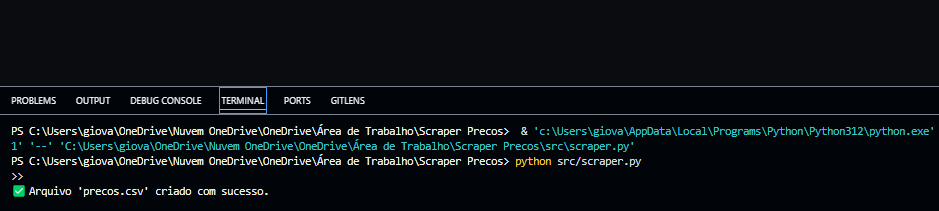
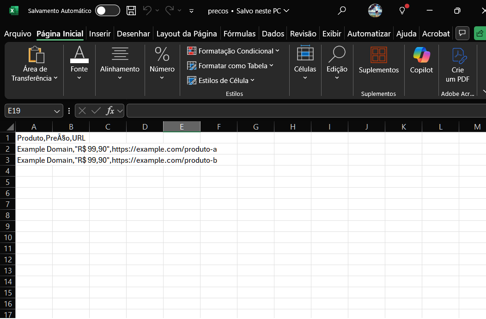
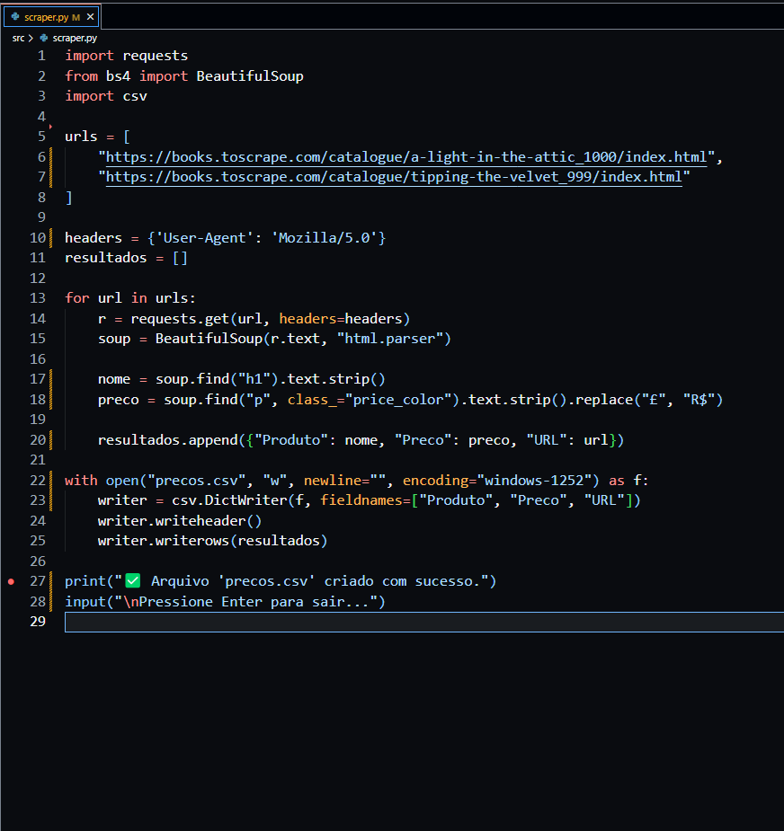

<br>

# Raspador de Preços em Python


Script simples para extrair preços de sites e salvar em CSV. Ideal para testes com scraping, coleta de dados automatizada e manipulação de informações no Python.

---

## Visão Geral

Projeto desenvolvido por **Giovane C Ramos** — voltado para a prática de automação com scraping.  
O objetivo é simular a coleta de preços em sites reais e exportar os dados em formato `.csv`, organizando o projeto de forma modular e clara para facilitar o entendimento.

---

## Objetivo do Projeto

Demonstrar um **scraper funcional em Python puro**, cobrindo:

- Requisições HTTP a URLs simuladas  
- Coleta de nome e preço de produtos  
- Exportação dos resultados para `precos.csv`  
- Organização do código com pastas, comentários e documentação  

---

## Tecnologias Utilizadas

- **Python 3**  
- **Requests** – requisições HTTP  
- **BeautifulSoup (bs4)** – análise de HTML  
- **CSV** – módulo nativo para exportar dados  

---

## Estrutura do Projeto

```text
raspador-precos-python/
├── README.md
├── precos.csv
├── src/
│   ├── scraper.py                 # versão funcional e limpa
│   └── scraper_com_explicacoes.py # versão comentada (backup didático)
├── assets/
│   ├── terminal_print.png         # execução no terminal
│   ├── excel_print.png            # CSV aberto no Excel
│   └── codigo_print.png           # trecho do código
└── docs/
    └── Projeto_Scraper.pdf        # documentação explicativa (v1.1)

```

## Como Executar o Projeto

1. **Clone o repositório:**
```bash
git clone https://github.com/giiotec/raspador-precos-python.git
cd raspador-precos-python

```

2. Instale as dependências:
```bash
pip install requests beautifulsoup4

```

3. Execute o script:
```bash
python src/scraper.py

```

4. Verifique o resultado: o arquivo precos.csv será criado na raiz do projeto com os dados coletados.

---

## Prints do Projeto
Imagens disponíveis em assets/:

terminal_print.png – execução do script

excel_print.png – dados visualizados no Excel

codigo_print.png – trecho do código em uso

---

## Documentação Extra
O arquivo docs/Projeto_Scraper.pdf traz:

Explicação linha por linha do código

Prints e observações visuais

Versão atual: v1.1

---

## Aplicações Reais
Monitoramento de preços em e-commerce

Rotinas de coleta de dados para revenda

Projeto de portfólio/freelance para mostrar domínio de scraping

---

## Autor

Giovane C Ramos – desenvolvedor em formação, apaixonado por Python, automações e soluções criativas.

---

## Contribuições
Sugestões ou correções são bem-vindas! Abra uma issue ou envie um pull request.

---

[](assets/terminal_print.png)
[](assets/excel_print.png)
[](assets/codigo_print.png)

---

 * Se este projeto te ajudou, deixe uma estrela!

---

## 🛡️ Licença

Este projeto está sob licença [MIT](LICENSE).


---
